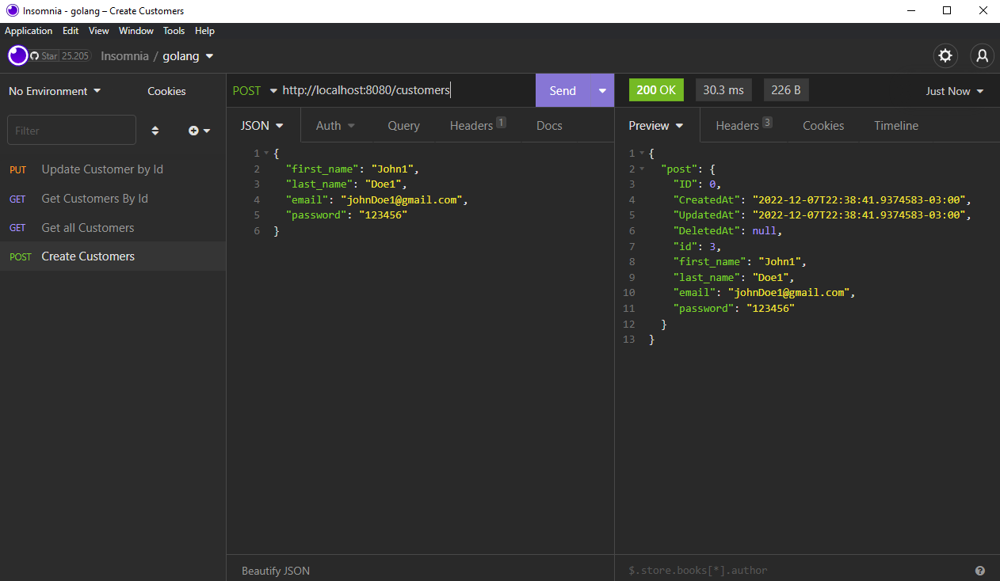
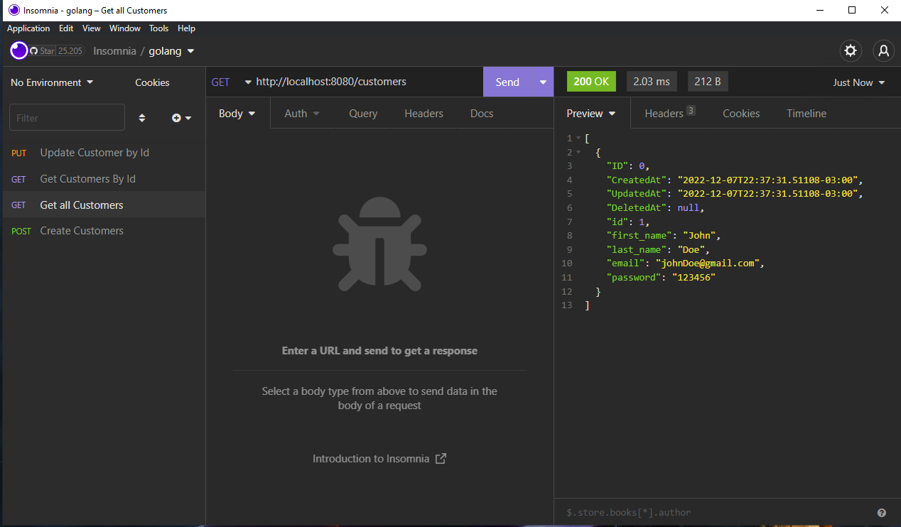
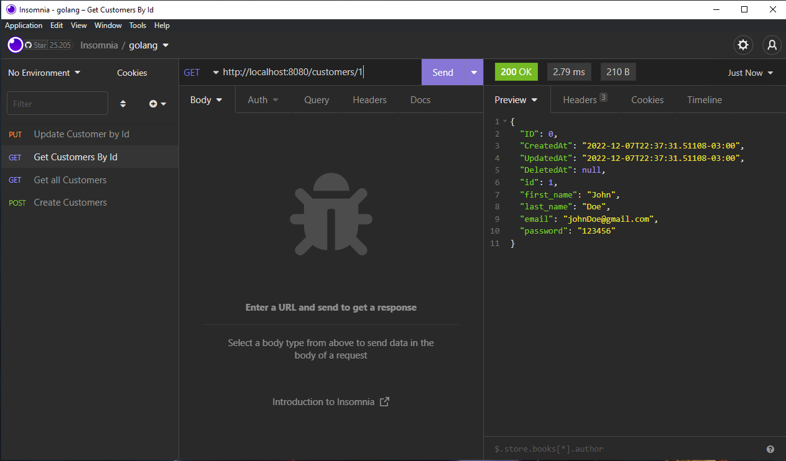
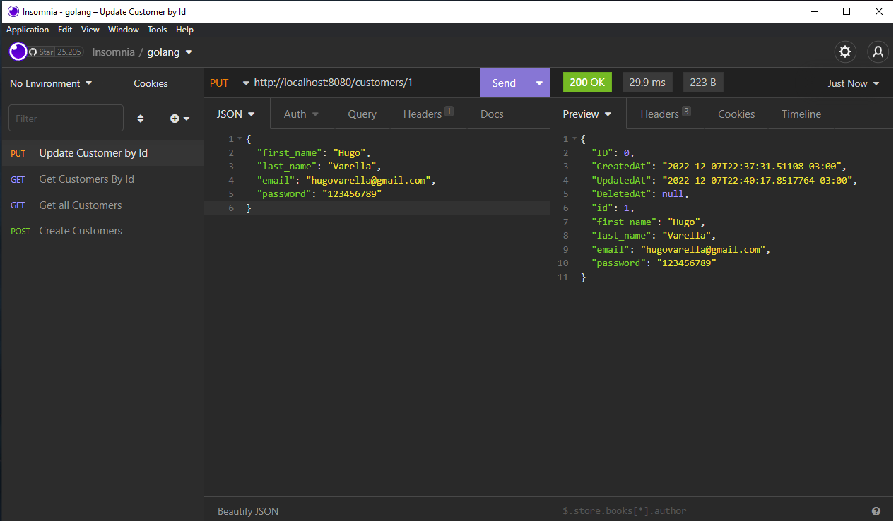

<h2 align="center">GoLang API REST</h2>

## 💻 Description

API of a CRUD use GoLang, docker-compose, postgres and gorm.

## 🛠️ Rotas

<div>
  
  
</div>
<div>
  
  
</div>


### 📝 Clone and use

```bash
   # Clone this repositorie
   $ git clone https://github.com/Hugovarellaa/golang-crud

   # Enter in folder
   $ cd golang-crud

   # Run postgresDB
   $ docker-compose up

   # Run Go Application
   $ go run main.go
```